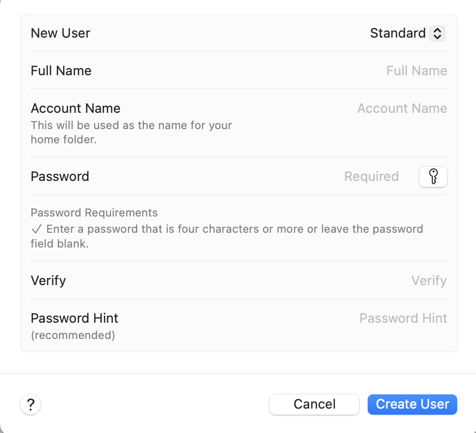

# gitee贡献者用户匹配问题

gitee提交代码时，关于贡献者，会通过`git config`配置的`user.email`来匹配用户，无论gitee中的某个账号（可能这个账号根本不属于你）的主邮箱还是提交邮箱与提交时你设置的`user.email`匹配一致，则认为贡献者就是这个被匹配到的用户，与你提交时具体登陆的账号没有关系。如果匹配不到，贡献者的名字会显示为会通过`git config`配置的`user.name`，邮箱会显示为通过`git config`配置的`user.email`，在gitee的网站中点击贡献者的头像会跳转发email。如果没有配置`user.email`,无论是否配置了`user.name`，贡献者的名称会设置为操作系统的账户的`全称`，email会设置为`账户名称@本机内网ip`（注意`账户名称`和账户`全称`不一样，这里使用mac做的实验，windows情况不详）。如果仅仅配置了`user.email`，没有配置`user.name`，则gitee网站中贡献者的名字会显示为提交时本机操作系统的用户`全称`（注意：这里用的是mac，windows不详，而且mac的用户`全称`和`账户名称`不是一个东西，具体有兴趣的人可以查一下）。

关于上文中的用户`全称`和`账户名称`，就是mac用户中的`Full Name`与`Account Name`。如下图：

如果在gitee的网站个人设置中->邮箱管理中，勾选了 ***禁止命令行推送泄漏个人邮箱***，并且同时勾选了 ***不公开我的邮箱地址***，则`user.email`设置为 ***主邮箱***，push不会成功。必须设置为系统提供的 ***提交邮箱***。

---

==自己总结==
