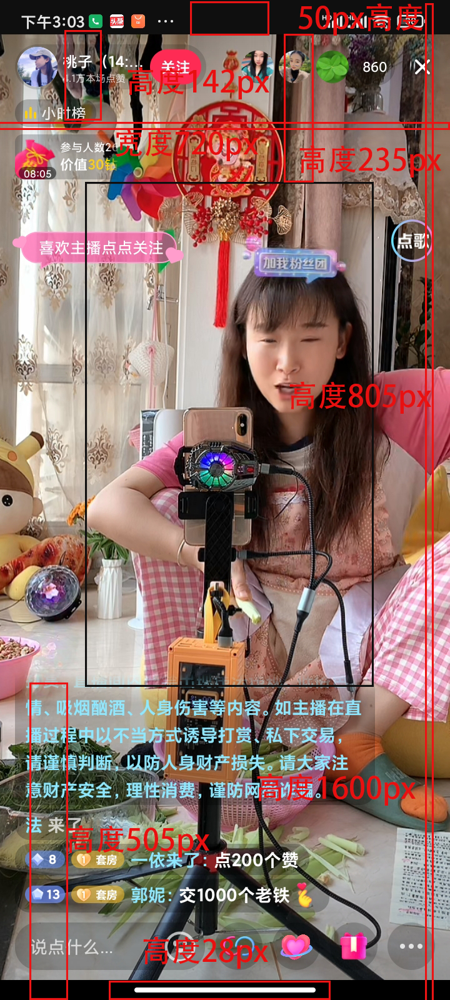

# 关于抖音直播时的相关尺寸问题

## 直播伴侣

推送视频的分辨率有：

- 蓝光 1920*1080，宽高比1.77778
- 超清 1280*720，宽高比1.77778
- 标清 860*540，宽高比1.5926

## 台式电脑

一般分辨率为 1920*1080，

## 手机分辨率

### 安卓

- 小米 2400*1080，高宽比2.2222
- 小米 1600*720，宽高比2.2222
- 华为 pura 70 Ultra 2844*1260，宽高比2.2571
- 华为 pura 70 pro+ 2844*1260，宽高比2.2571
- 华为 pura 70 pro 2844*1260，宽高比2.2571
- 华为 pura 70 2760*1256，宽高比2.1975
- 华为 pocket 2 2690*1136，宽高比2.3680
- 华为 meta 60 pro+ 2720*1260，宽高比2.1587
- 华为 meta 60 pro 2720*1260，宽高比2.1587
- 华为 meta 60 2688*1216，宽高比2.2105
- 华为 meta 60 RS 2720*1260，宽高比2.1587
- 华为 meta 60 X5 外屏2504*1080，宽高比2.3185 内屏2496*2224，宽高比1.1223
- 华为 nova 11 se 2400*1080，宽高比2.2222
- 华为 nova 12 2412*1084，宽高比2.2251
- 华为 nova 12 Ultra 2776*1224，宽高比2.2680
- 华为 nova 12 Pro 2776*1224，宽高比2.2680
- vivo 100s pro 2800*1260，宽高比2.2222
- vivo 100s 2800*1260，宽高比2.2222
- vivo 100s Ultra 2800*1260，宽高比2.2222
- vivo 100 pro 2800*1260，宽高比2.2222
- vivo 100 2800*1260，宽高比2.2222
- vivo S18 2800*1260，宽高比2.2222
- vivo S18e 2400*1080，宽高比2.2222
- vivo S18 pro 2800*1260，宽高比2.2222

==最高宽高比2.3680==

### 苹果

- 苹果SE 1136*640，宽高比1.775
- 苹果6 1334*750，宽高比1.7787
- 苹果6 plus 1920*1080，宽高比1.7778
- 苹果6s 1334*750，宽高比1.7787
- 苹果7 1334*750，宽高比1.7787
- 苹果7 plus 1920*1080，宽高比1.7778
- 苹果8 1334*750，宽高比1.7787
- 苹果8 plus 1920*1080，宽高比1.7778
- 苹果 X 2436*1125，宽高比2.1653
- 苹果 XR 1792*828，宽高比2.1643
- 苹果 XS 2436*1125，宽高比2.1653
- 苹果 XSmax 2688*1242，宽高比2.1643
- 苹果11 1792*828，宽高比2.1643
- 苹果11 pro 2436*1125，宽高比2.1653
- 苹果11 promax 2688*1242，宽高比2.1643
- 苹果12 2532*1170，宽高比2.1641
- 苹果12 mini 2340*1080，宽高比2.1667
- 苹果12 pro 2532*1170，宽高比2.1641
- 苹果12 promax 2778*1284，宽高比2.1636
- 苹果13 2532*1170，宽高比2.1641
- 苹果13 mini 2340*1080，宽高比2.1667
- 苹果13 pro 2532*1170，宽高比2.1641
- 苹果13 promax 2778*1284，宽高比2.1636
- 苹果14 2532*1170，宽高比2.1641
- 苹果14 plus 2778*1284，宽高比2.1635
- 苹果14 pro 2556*1179，宽高比2.1679
- 苹果14 promax 2796*1290，宽高比2.1674
- 苹果15 2556*1179，宽高比2.1679
- 苹果15 plus 2796*1290，宽高比2.1674
- 苹果15 2556*1179，宽高比2.1679
- 苹果15 promax 2796*1290，宽高比2.1674

## 布局分析

通过下面3个例子的分析，得出：

- 中间无遮挡区域的比例选择最小的1.1111
- 无遮挡区域的顶部距离选择最大的0.1546倍的可显示高度

### 关于红米1600\*720直播间布局分析

顶部黑条50px，底部黑条30px，实际展示尺寸1520px，中间无遮挡区域800px，中间无遮挡区域距离实际展示区域顶部235px，底部评论区480px。由此得出：

- 实际宽高比为：1520/720=2.1111
- 无遮挡区域距离实际可显示区域顶部235px，站可显示高度的235/1520=0.1546
- 底部评论区高度480px
- 中间无遮挡区域高度800px
- 中间无遮挡区域的宽高比为：800/720=1.1111

### 关于红米2400\*1080直播间布局分析

顶部黑条100px，实际可显示高度2300px，中间无遮挡区域高度1320px、宽度1080px，底部评论区650px，无遮挡区域距离可实际显示区域顶部320px。由此得出：

- 实际显示宽高比为：2300/1080=2.1296
- 无遮挡区域距离实际可显示区域顶部320px，占可显示高度的320/2300=0.1391
- 底部评论区高度650px
- 中间无遮挡区域高度1320px
- 中间无遮挡区域宽高比为：1320/1080=1.2222

### 关于苹果14 pro max直播间布局分析

无遮挡区域距离实际可展示区域230px，底部评论区775px。由此得出：

- 实际显示宽高度：2.1674
- 无遮挡区域距离实际可显示区域顶部230px，占可显示高度的230/2796=0.0823
- 底部评论区高度775px
- 无遮挡显示区域高度：2796-230-775=1791px
- 中间无遮挡区域宽高比为：1791/1290=1.3884
