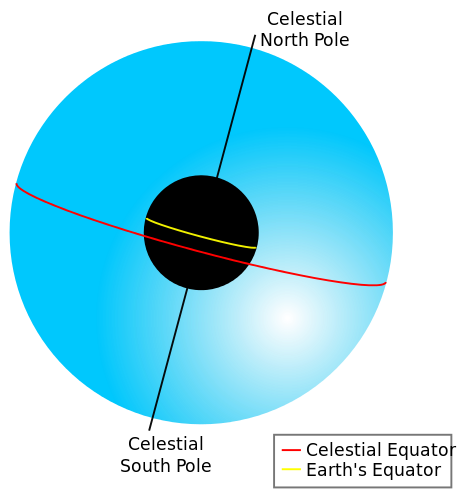
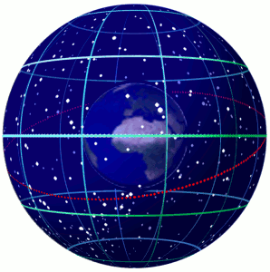

# 天球

天球（英语：Celestial sphere），是在天文学和导航上想出的一个与地球同球心，并有相同的自转轴，半径无限大的球。天空中所有的物体都可以当成投影在天球上的物件。地球的赤道和地理极点投射到天球上，就是天球赤道和天极。天球是位置天文学上很实用的工具。

在亚里士多德和托勒密的模型，天球想像成实际的物体，而不仅仅是一个几何的投影（参见天球模型）。

天球被天球赤道平分。图中还可见地球的赤道、天北极和天南极

地球在一个半径相对细小，以地球为基础的天球中旋转的动画。图中还可见黄道（红）和天球坐标系统上的赤经、赤纬（绿）

## 视差效应

天球可以使用地心为中心，也可以使用地表为中心的体系。前者的作法是假设观察者位于地球的中心，因此不需要考虑视差的影响。后者的中心是观测者位于的地球表面，因此地平视差的影响是不能忽略的，特别是月球的位置。

## 半天球

天球被赤道的投影分为两个空间，分别为南天球和北天球。同样的，我们也可以在天球上找到北回归线、南回归线、天北极和天南极，可以量化天球上各种物体的方向，建构出各种的天球坐标系统。

**因为地球是自西向东旋转，所以我们就把天球看成是自东向西旋转。**

太阳在天球上每天移动约1度，一年则移动一周（360度），这称之为太阳周年视运动，太阳中心在天球上视运动的轨迹则是黄道。

## 恒星时

随着地球绕着轴心以23小时56分的周期由西向东自转，天球和所有的天体都以[天球极点](./天极.md)为中心，以相同的时间由东向西移转动，这就是周日运动。因此恒星会由东方升起，通过南北向的子午线过中天，然后在西方没入（除非这颗恒星是拱极星）。第二天晚上，天体在特定的时间会再东升，但是因为我们的钟表时间是24小时整，因此会提早4分钟升起；再过一晚早8分钟升起，也就是说每天都会提早4分钟。

这种与钟表时间明显的不一致是因为太阳不是固定在天球上的天体，每天会在天球上的黄道，一个大圆，向东移动约1°（这是太阳的周年运动，一年在天球上360°，或是完整的圆周）。如果以4分钟的时间对应于角度的1°（360° = 24小时），则需要额外的4分钟太阳才会回到上回的相对位置，例如中天的子午线，完成完整的一圈运动要24小时（这是忽略季节性变化的平均值，参见均时差）。

因此，一般的时钟显示的是太阳时，天文学家研究恒星运动使用的是恒星时，等同于太阳时的23小时56分。

## 恒星球

天球也可以引用到天球的物理模型，就是所谓的恒星球，这种天球可以显示出在指定的时间和地点可以看见的部分星座。

---

==wiki==

<https://zh.wikipedia.org/wiki/%E5%A4%A9%E7%90%83>
