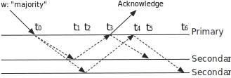

# Read Concern "local"

(==官方原文地址：<https://www.mongodb.com/docs/v5.0/reference/read-concern-local/>==)

A query with read concern "local" returns data from the instance with no guarantee that the data has been written to a majority of the replica set members (i.e. may be rolled back).

一个带有读关注"local"的查询从实例返回数据，没有保证数据已写入大多数副本集成员（即可能被回滚）。

Read concern "local" is the default for read operations against the primary and secondaries.

写关注“local”是针对主节点和从节点的读操作的默认值。

Regardless of the read concern level, the most recent data on a node may not reflect the most recent version of the data in the system.

无论读关注级别如何，节点上的最新数据可能不反映系统中的最新数据版本。

## Availability

Read concern "local" is available for use with or without causally consistent sessions and transactions.

写关注“local”可用于有或没有因果一致会话和事务。

## Read Concern local and Transactions

You set the read concern at the transaction level, not at the individual operation level. To set the read concern for transactions, see Transactions and Read Concern.

你设置读关注在事务级别，而不是在单个操作级别。要设置事务的读关注，请参阅事务和读关注。

You can create collections and indexes inside a transaction. If explicitly creating a collection or an index, the transaction must use read concern "local". If you implicitly create a collection, you can use any of the read concerns available for transactions.

你可以创建集合和索引在事务中。如果显示的创建一个集合或者索引，事务必须使用“local”读关注。如果你隐士的创建集合，你可使用任意事务可用的读关注

## Example

Consider the following timeline of a write operation Write 0 to a three member replica set:

考虑一个三成员副本集的写操作时间线，Write 0：

> **NOTE**
> For simplification, the example assumes:
> 为了简化，例子假设：
>
> - All writes prior to Write 0 have been successfully replicated to all members.
> - Write prev is the previous write before Write 0.
> - No other writes have occured after Write 0.
>
> - Write 0之前的所有写操作都已经成中的复制到了所有成员
> - Write prev在Write 0之前写入
> - Write 0之后没有其他写操作

|Time|Event|Most Recent Write|Most Recent Write with "majority" concern|
|---|---|---|---|
|t 0|Primary applies Write 0|**Primary**: Write 0 **Secondary 1**: Write prev **Secondary 2**: Write prev|**Primary**: Write prev **Secondary 1**: Write prev **Secondary 2**: Write prev|
|t 1|Secondary 1 applies write 0|**Primary**: Write 0 **Secondary 1**: Write 0 **Secondary 2**: Write prev|**Primary**: Write prev **Secondary 1**: Write prev **Secondary 2**: Write prev|
|t 2|Secondary 2 applies write 0|**Primary**: Write 0 **Secondary 1**: Write 0 **Secondary 2**: Write 0|**Primary**: Write prev **Secondary 1**: Write prev **Secondary 2**: Write prev|
|t 3|Primary is aware of successful replication to Secondary 1 and sends acknowledgement to client|**Primary**: Write 0 **Secondary 1**: Write 0 **Secondary 2**: Write 0|**Primary**: Write 0 **Secondary 1**: Write prev **Secondary 2**: Write prev|
|t 4|Primary is aware of successful replication to Secondary 2|**Primary**: Write 0 **Secondary 1**: Write 0 **Secondary 2**: Write 0|**Primary**: Write 0 **Secondary 1**: Write prev **Secondary 2**: Write prev|
|t 5|Secondary 1 receives notice (through regular replication mechanism) to update its snapshot of its most recent w: "majority" write|**Primary**: Write 0 **Secondary 1**: Write 0 **Secondary 2**: Write 0|**Primary**: Write 0 **Secondary 1**: Write 0 **Secondary 2**: Write prev|
|t 6|Secondary 2 receives notice (through regular replication mechanism) to update its snapshot of its most recent w: "majority" write|**Primary**: Write 0 **Secondary 1**: Write 0 **Secondary 2**: Write 0|**Primary**: Write 0 **Secondary 1**: Write 0 **Secondary 2**: Write 0|

Then, the following tables summarizes the state of the data that a read operation with "local" read concern would see at time T.

然后，以下表格总结了在时间 T 时，带有“local”读关注的数据状态。

|Read Target|Time T|State of Data|
|---|---|---|
|Primary|After t 0|Data reflects Write 0|
|Secondary 1|Before t 1|Data reflects Write prev|
|Secondary 1|After t 1|Data reflects Write 0|
|Secondary 2|Before t 2|Data reflects Write prev|
|Secondary 2|After t 2|Data reflects Write 0|
