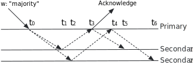

# read concern "majority"

<https://www.mongodb.com/docs/v5.0/reference/read-concern-majority/>

**"majority"**

For read operations not associated with multi-document transactions, read concern "majority" guarantees that the data read has been acknowledged by a majority of the replica set members (i.e. the documents read are durable and guaranteed not to roll back).

对于非多文档事务的读操作，读关注"majority"保证读取的数据已经被大多数副本集成员确认（即读取的数据是持久的，保证不会回滚）。

For operations in multi-document transactions, read concern "majority" provides its guarantees only if the transaction commits with write concern "majority". Otherwise, the "majority" read concern provides no guarantees about the data read in transactions.

对于多文档事务中的操作，只有在事务提交时使用写关注"majority"，读关注"majority"才能提供他的保证。否则，读关注"majority"对事务中的数据读取没有任何保证。

Regardless of the read concern level, the most recent data on a node may not reflect the most recent version of the data in the system.

无论读关注级别如何，节点上的最新数据可能不反映系统中的最新数据版本。

## Performance

Each replica set member maintains, in memory, a view of the data at the majority-commit point; the majority-commit point is calculated by the primary. To fulfill read concern "majority", the node returns data from this view and is comparable in performance cost to other read concerns.

每个副本集成员在内存中维护一个视图，视图的数据是大多数提交点（majority-commit point）的数据；大多数提交点由主节点计算。为了满足读关注"majority"，节点从该视图中返回数据，其性能成本与其它读关注相当。

## Availability

Read concern "majority" is available for use with or without causally consistent sessions and transactions.

Read关注"majority"可用于有因果一致会话和事务，也可用于没有因果一致会话和事务。

> **warning**
> If you are using a three-member primary-secondary-arbiter (PSA) architecture, consider the following:
>
> - The write concern "majority" can cause performance issues if a secondary is unavailable or lagging. For advice on how to mitigate these issues, see Mitigate Performance Issues with a Self-Managed PSA Replica Set.
> - If you are using a global default "majority" and the write concern is less than the size of the majority, your queries may return stale (not fully replicated) data.
>
> 如果使用三成员主从仲裁（PSA）架构，请考虑以下内容：
>
> - 写关注"majority"可能会导致性能问题，如果一个从节点不可用或滞后。有关如何缓解这些问题的建议，请参阅使用自管理PSA副本集缓解性能问题。
> - 如果使用全局默认的"majority"，并且写关注小于大多数成员的大小，则查询可能会返回过时的（未完全复制）数据。

## Example

Consider the following timeline of a write operation Write 0 to a three member replica set:

考虑以下时间线，写操作将0写入三成员副本集：

> **NOTE**
>
> For simplification, the example assumes:
>
> - All writes prior to Write 0 have been successfully replicated to all members.
> - Write *prev* is the previous write before Write 0.
> - No other writes have occured after Write 0.
>
> 为了简化，示例假设：
>
> - 在写入0之前，所有写入都已成功复制到所有成员。
> - Write prev 是写入0之前的上一个写入。
> - 在写入0之后没有其他写入。

|Time|Event|Most Recent Write|Most Recent Write with "majority" concern|
|---|---|---|---|
|t 0|Primary applies Write 0|**Primary**: Write 0 **Secondary 1**: Write prev **Secondary 2**: Write prev|**Primary**: Write prev **Secondary 1**: Write prev **Secondary 2**: Write prev|
|t 1|Secondary 1 applies write 0|**Primary**: Write 0 **Secondary 1**: Write 0 **Secondary 2**: Write prev|**Primary**: Write prev **Secondary 1**: Write prev **Secondary 2**: Write prev|
|t 2|Secondary 2 applies write 0|**Primary**: Write 0 **Secondary 1**: Write 0 **Secondary 2**: Write 0|**Primary**: Write prev **Secondary 1**: Write prev **Secondary 2**: Write prev|
|t 3|Primary is aware of successful replication to Secondary 1 and sends acknowledgement to client|**Primary**: Write 0 **Secondary 1**: Write 0 **Secondary 2**: Write 0|**Primary**: Write 0 **Secondary 1**: Write prev **Secondary 2**: Write prev|
|t 4|Primary is aware of successful replication to Secondary 2|**Primary**: Write 0 **Secondary 1**: Write 0 **Secondary 2**: Write 0|**Primary**: Write 0 **Secondary 1**: Write prev **Secondary 2**: Write prev|
|t 5|Secondary 1 receives notice (through regular replication mechanism) to update its snapshot of its most recent w: "majority" write|**Primary**: Write 0 **Secondary 1**: Write 0 **Secondary 2**: Write 0|**Primary**: Write 0 **Secondary 1**: Write 0 **Secondary 2**: Write prev|
|t 6|Secondary 2 receives notice (through regular replication mechanism) to update its snapshot of its most recent w: "majority" write|**Primary**: Write 0 **Secondary 1**: Write 0 **Secondary 2**: Write 0|**Primary**: Write 0 **Secondary 1**: Write 0 **Secondary 2**: Write 0|

Then, the following tables summarizes the state of the data that a read operation with "majority" read concern would see at time T.

以下表格总结了在时间T时，具有读关注"majority"的读操作所看到的数据状态。

|Read Target|Time T|State of Data|
|---|---|---|
|Primary|Before t 3|Data reflects Write prev|
|Primary|After t 3|Data reflects Write 0|
|Secondary 1|Before t 5|Data reflects Write prev|
|Secondary 1|After t 5|Data reflects Write 0|
|Secondary 2|Before t 6|Data reflects Write prev|
|Secondary 2|After t 6|Data reflects Write 0|

## Storage Engine Support

Read concern "majority" is available for the WiredTiger storage engine.

Read关注"majority"适用于WiredTiger存储引擎。

> **Tip**
>
> The serverStatus command returns the storageEngine.supportsCommittedReads field which indicates whether the storage engine supports "majority" read concern.
> serverStatus命令返回storageEngine.supportsCommittedReads字段，该字段指示存储引擎是否支持读关注"majority"。

## Read Concern "majority" and Transactions

> **NOTE**
>
> Read concern "majority" is not supported in multi-document transactions.
>
> Read关注"majority"不支持多文档事务。

For operations in multi-document transactions, read concern "majority" provides its guarantees only if the transaction commits with write concern "majority". Otherwise, the "majority" read concern provides no guarantees about the data read in transactions.

对于多文档事务中的操作，只有在事务提交时使用写关注"majority"，读关注"majority"才能提供他的保证。否则，读关注"majority"对事务中的数据读取没有任何保证。

## Read Concern "majority" and Aggregation

You can specify read concern level "majority" for an aggregation that includes an $out stage.

你可以为包含$out阶段的聚合指定读关注级别"majority"。

## Read Your Own Writes

You can use causally consistent sessions to read your own writes, if the writes request acknowledgment.

如果你请求确认写入，则可以使用因果一致会话读取你自己的写入。

## Primary-Secondary-Arbiter Replica Sets

Starting in MongoDB 5.0, enableMajorityReadConcern and --enableMajorityReadConcern cannot be changed and are always set to true due to storage engine improvements.

从MongoDB 5.0开始，由于存储引擎改进，enableMajorityReadConcern和--enableMajorityReadConcern无法更改，并且始终设置为true。

In earlier versions of MongoDB, enableMajorityReadConcern and --enableMajorityReadConcern are configurable and can be set to false to prevent storage cache pressure from immobilizing a deployment with a three-member primary-secondary-arbiter (PSA) architecture.

在MongoDB的早期版本中，enableMajorityReadConcern和--enableMajorityReadConcern是可配置的，可以设置为false，以防止存储引擎缓存压力使具有三成员主从仲裁（PSA）架构的部署僵化。

If you are using a three-member primary-secondary-arbiter (PSA) architecture, consider the following:

- The write concern "majority" can cause performance issues if a secondary is unavailable or lagging. For advice on how to mitigate these issues, see Mitigate Performance Issues with a Self-Managed PSA Replica Set.
- If you are using a global default "majority" and the write concern is less than the size of the majority, your queries may return stale (not fully replicated) data.

如果使用三成员主从仲裁（PSA）架构，请考虑以下内容：

- 写关注"majority"可能会导致性能问题，如果一个从节点不可用或滞后。有关如何缓解这些问题的建议，请参阅使用自管理PSA副本集缓解性能问题。
- 如果使用全局默认的"majority"，并且写关注小于大多数成员的大小，则查询可能会返回过时的（未完全复制）数据。
