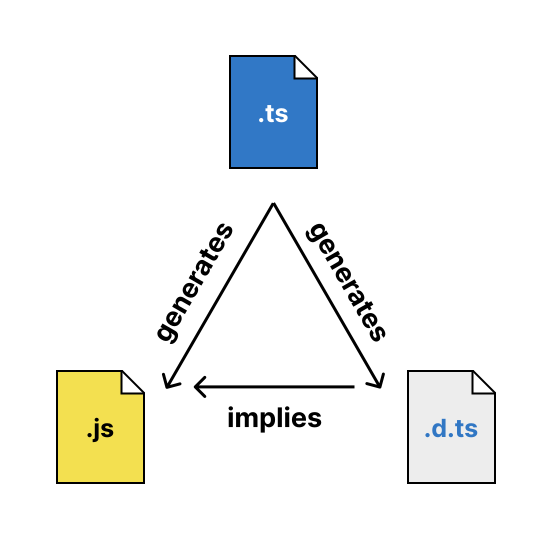

# Module resolution

==(官方文档：<https://www.typescriptlang.org/docs/handbook/modules/theory.html#module-resolution>)==

Let’s return to our first example and review what we’ve learned about it so far:

让我们回到第一个例子，回顾一下我们到目前为止学到的内容：

```ts
import sayHello from "greetings";
sayHello("world");
```

So far, we’ve discussed how the host’s module system and TypeScript’s `module` compiler option might impact this code. We know that the input syntax looks like ESM, but the output format depends on the `module` compiler option, potentially the file extension, and `package.json` `"type"` field. We also know that what `sayHello` gets bound to, and even whether the import is even allowed, may vary depending on the module kinds of this file and the target file. But we haven’t yet discussed how to find the target file.

到目前为止，我们已经讨论了宿主的模块系统和 TypeScript 的 `module` 编译选项可能如何影响这段代码。我们知道输入语法看起来像 ESM，但输出格式取决于 `module` 编译选项，可能还取决于文件扩展名和 `package.json` 中的 `"type"` 字段。我们还知道 `sayHello` 绑定到什么，以及导入是否被允许，可能会因该文件和目标文件的模块类型而有所不同。但我们还没有讨论如何找到目标文件。

## Module resolution is host-defined

While the ECMAScript specification defines how to parse and interpret `import` and `export` statements, it leaves module resolution up to the host. If you’re creating a hot new JavaScript runtime, you’re free to create a module resolution scheme like:

虽然 ECMAScript 规范定义了如何解析和解释 import 和 export 语句，但它将模块解析留给了宿主。如果你正在创建一个新的 JavaScript 运行时，你可以自由地创建一个模块解析方案，例如：

```ts
import monkey from "🐒"; // Looks for './eats/bananas.js'
import cow from "🐄";    // Looks for './eats/grass.js'
import lion from "🦁";   // Looks for './eats/you.js'
```

and still claim to implement “standards-compliant ESM.” Needless to say, TypeScript would have no idea what types to assign to `monkey`, `cow`, and `lion` without built-in knowledge of this runtime’s module resolution algorithm. Just as module informs the compiler about the host’s expected module format, `moduleResolution`, along with a few customization options, specify the algorithm the host uses to resolve module specifiers to files. This also clarifies why TypeScript doesn’t modify import specifiers during emit: the relationship between an import specifier and a file on disk (if one even exists) is host-defined, and TypeScript is not a host.

并且仍然声称实现了“符合标准的 ESM”。不用说，如果没有内置的模块解析算法知识，TypeScript 将不知道如何为 monkey、cow 和 lion 分配类型。正如 `module` 告诉编译器宿主期望的模块格式一样，`moduleResolution` 以及一些自定义选项指定了宿主用于将模块说明符解析为文件的算法(:pill:==**这一句解答了问题，moduleResolution是干嘛的**==)。这也解释了为什么 TypeScript 在发出代码时不修改导入说明符：导入说明符与磁盘上文件（如果存在的话）之间的关系是由宿主定义的，而 TypeScript 不是宿主。

The available `moduleResolution` options are:

- [classic](https://www.typescriptlang.org/docs/handbook/modules/reference.html#classic): TypeScript’s oldest module resolution mode, this is unfortunately the default when `module` is set to anything other than `commonjs`, `node16`, or `nodenext`. It was probably made to provide best-effort resolution for a wide range of [RequireJS](https://requirejs.org/docs/api.html#packages) configurations. It should not be used for new projects (or even old projects that don’t use RequireJS or another AMD module loader), and is scheduled for deprecation in TypeScript 6.0.
- node10: Formerly known as `node`, this is the unfortunate default when `module` is set to `commonjs`. It’s a pretty good model of Node.js versions older than v12, and sometimes it’s a passable approximation of how most bundlers do module resolution. It supports looking up packages from `node_modules`, loading directory `index.js` files, and omitting `.js` extensions in relative module specifiers. Because Node.js v12 introduced different module resolution rules for ES modules, though, it’s a very bad model of modern versions of Node.js. It should not be used for new projects.
- node16: This is the counterpart of `-module node16` and is set by default with that `module` setting. Node.js v12 and later support both ESM and CJS, each of which uses its own module resolution algorithm. In Node.js, module specifiers in import statements and dynamic `import()` calls are not allowed to omit file extensions or `/index.js` suffixes, while module specifiers in `require` calls are. This module resolution mode understands and enforces this restriction where necessary, as determined by the [module format detection rules](https://www.typescriptlang.org/docs/handbook/modules/theory.html#module-format-detection) instated by `--module node16`. (For `node16` and `nodenext`, `module` and `moduleResolution` go hand-in-hand: setting one to `node16` or `nodenext` while setting the other to something else has unsupported behavior and may be an error in the future.)
- nodenext: Currently identical to `node16`, this is the counterpart of `--module nodenext` and is set by default with that `module` setting. It’s intended to be a forward-looking mode that will support new Node.js module resolution features as they’re added.
- bundler: Node.js v12 introduced some new module resolution features for importing npm packages—the `"exports"` and `"imports"` fields of `package.json`—and many bundlers adopted those features without also adopting the stricter rules for ESM imports. This module resolution mode provides a base algorithm for code targeting a bundler. It supports `package.json` `"exports"` and `"imports"` by default, but can be configured to ignore them. It requires setting `module` to `esnext`.

可用的 `moduleResolution` 选项有：

- [classic](https://www.typescriptlang.org/docs/handbook/modules/reference.html#classic)：TypeScript 最古老的模块解析模式，不幸的是，当 `module` 设置为 `commonjs`、`node16` 或 `nodenext` 以外的任何值时，这是默认选项。它可能是为了为广泛的 [RequireJS](https://requirejs.org/docs/api.html#packages) 配置提供最佳努力的解析而创建的。不应在新项目中使用（甚至不应在不使用 RequireJS 或其他 AMD 模块加载器的旧项目中使用），并计划在 TypeScript 6.0 中弃用。
- node10：以前称为 `node`，当 `module` 设置为 `commonjs` 时，这是不幸的默认选项。它是 v12 之前的 Node.js 版本的一个相当好的模型，有时也是大多数打包器进行模块解析的一个可接受的近似。它支持从 `node_modules` 查找包，加载目录 `index.js` 文件，以及在相对模块说明符中省略 `.js` 扩展名。但是，由于 Node.js v12 为 ES 模块引入了不同的模块解析规则，所以它是现代 Node.js 版本的一个非常糟糕的模型。不应在新项目中使用。
- node16：这是 `-module node16` 的对应选项，并在该模块设置下默认设置。Node.js v12 及更高版本同时支持 ESM 和 CJS，每种都使用自己的模块解析算法。在 Node.js 中，import 语句和动态 `import()` 调用中的模块说明符不允许省略文件扩展名或 `/index.js` 后缀，而 `require` 调用中的模块说明符则允许。这种模块解析模式理解并在必要时强制执行这种限制，具体由 `--module node16` 设置的[模块格式检测规则](https://www.typescriptlang.org/docs/handbook/modules/theory.html#module-format-detection)决定。（对于 `node16` 和 `nodenext`，`module` 和 `moduleResolution` 是密切相关的：将其中一个设置为 `node16` 或 `nodenext`，而将另一个设置为其他值会导致不支持的行为，将来可能会报错。）
- nodenext：目前与 `node16` 相同，这是 `--module nodenext` 的对应选项，并在该模块设置下默认设置。它旨在成为一个前瞻性的模式，将支持新的 Node.js 模块解析功能，随着这些功能的添加而更新。
- bundler：Node.js v12 引入了一些新的模块解析功能，用于导入 npm 包——`package.json` 的 `"exports"` 和 `"imports"` 字段——许多打包器采用了这些功能，但没有同时采用更严格的 ESM 导入规则。这种模块解析模式为针对打包器的代码提供了一个基本算法。它默认支持 `package.json` 的 `"exports"` 和 `"imports"`，但可以配置为忽略它们。它要求将 `module` 设置为 `esnext

## TypeScript imitates the host’s module resolution, but with types

Remember the three components of TypeScript’s [job](https://www.typescriptlang.org/docs/handbook/modules/theory.html#typescripts-job-concerning-modules) concerning modules?

1. Compile files into a valid **output module format**
2. Ensure that imports in those **outputs** will **resolve successfully**
3. Know what **type** to assign to **imported names**.

还记得 TypeScript 关于模块的[工作](https://www.typescriptlang.org/docs/handbook/modules/theory.html#typescripts-job-concerning-modules)的三个组成部分吗？

1. 将文件编译成有效的**输出模块格式**
2. 确保这些**输出**中的导入将**成功解析**
3. 知道要为**导入的名称**分配什么**类型**

Module resolution is needed to accomplish last two. But when we spend most of our time working in input files, it can be easy to forget about (2)—that a key component of module resolution is validating that the imports or `require` calls in the output files, containing the [same module specifiers as the input files](https://www.typescriptlang.org/docs/handbook/modules/theory.html#module-specifiers-are-not-transformed), will actually work at runtime. Let’s look at a new example with multiple files:

模块解析是为了完成后两项任务。但当我们大部分时间都在处理输入文件时，很容易忘记（2）—— 模块解析的一个关键组成部分是验证输出文件中的导入或 `require` 调用（包含[与输入文件相同的模块说明符](https://www.typescriptlang.org/docs/handbook/modules/theory.html#module-specifiers-are-not-transformed)）在运行时是否真的能工作。让我们看一个包含多个文件的新例子：

```ts
// @Filename: math.ts
export function add(a: number, b: number) {
  return a + b;
}
// @Filename: main.ts
import { add } from "./math";
add(1, 2);
```

When we see the import from `"./math"`, it might be tempting to think, “This is how one TypeScript file refers to another. The compiler follows this (extensionless) path in order to assign a type to `add.`”

当我们看到从 `"./math"` 导入时，可能会倾向于认为，"这就是一个 TypeScript 文件引用另一个文件的方式。编译器遵循这个（无扩展名的）路径来为 `add` 分配类型。"


This isn’t entirely wrong, but the reality is deeper. The resolution of `"./math"` (and subsequently, the type of add) need to reflect the reality of what happens at runtime to the output files. A more robust way to think about this process would look like this:

这并不完全错误，但实际情况更为复杂。`"./math"` 的解析（以及随后 `add` 的类型）需要反映输出文件在运行时发生的实际情况。更稳健的思考这个过程的方法如下：



This model makes it clear that for TypeScript, module resolution is mostly a matter of accurately modeling the host’s module resolution algorithm between output files, with a little bit of remapping applied to find type information. Let’s look at another example that appears unintuitive through the lens of the simple model, but makes perfect sense with the robust model:

这个模型清楚地表明，对于 TypeScript 来说，模块解析主要是准确模拟输出文件之间宿主的模块解析算法，并应用一些重映射来找到类型信息。让我们看另一个通过简单模型看起来不直观的例子，但通过稳健模型看起来非常合理：

```ts
// @moduleResolution: node16
// @rootDir: src
// @outDir: dist
// @Filename: src/math.mts
export function add(a: number, b: number) {
  return a + b;
}
// @Filename: src/main.mts
import { add } from "./math.mjs";
add(1, 2);
```

Node.js ESM `import` declarations use a strict module resolution algorithm that requires relative paths to include file extensions. When we only think about input files, it’s a little strange that `"./math.mjs"` seems to resolve to `math.mts`. Since we’re using an `outDir` to put compiled outputs in a different directory, `math.mjs` doesn’t even exist next to `main.mts`! Why should this resolve? With our new mental model, it’s no problem:

Node.js ESM `import` 声明使用严格的模块解析算法，要求相对路径包含文件扩展名。当我们只考虑输入文件时，`"./math.mjs"` 解析为 `math.mts` 似乎有点奇怪。由于我们使用 `outDir` 将编译输出放在不同的目录中，`math.mjs` 甚至不存在于 `main.mts` 旁边！为什么这应该解析？使用我们的新思维模型，这不是问题：



Understanding this mental model may not immediately eliminate the strangeness of seeing output file extensions in input files, and it’s natural to think in terms of shortcuts: "./math.mjs" refers to the input file math.mts. I have to write the output extension, but the compiler knows to look for .mts when I write .mjs. This shortcut is even how the compiler works internally, but the more robust mental model explains why module resolution in TypeScript works this way: given the constraint that the module specifier in the output file will be the same as the module specifier in the input file, this is the only process that accomplishes our two goals of validating output files and assigning types.

理解这个思维模型可能不会立即消除在输入文件中看到输出文件扩展名的奇怪感觉，并且很自然地会想到捷径：“./math.mjs” 指的是输入文件 math.mts。我必须写输出扩展名，但编译器知道当我写 .mjs 时要查找 .mts。这种捷径甚至是编译器内部的工作方式，但更稳健的思维模型解释了为什么 TypeScript 的模块解析是这样工作的：鉴于输出文件中的模块说明符将与输入文件中的模块说明符相同的约束，这是实现验证输出文件和分配类型这两个目标的唯一过程。

## The role of declaration files

In the previous example, we saw the “remapping” part of module resolution working between input and output files. But what happens when we import library code? Even if the library was written in TypeScript, it may not have published its source code. If we can’t rely on mapping the library’s JavaScript files back to a TypeScript file, we can verify that our import works at runtime, but how do we accomplish our second goal of assigning types?

在前面的例子中，我们看到了模块解析在输入和输出文件之间的“重映射”部分。但当我们导入库代码时会发生什么？即使库是用 TypeScript 编写的，它也可能没有发布其源代码。如果我们不能依赖将库的 JavaScript 文件映射回 TypeScript 文件，我们可以验证我们的导入在运行时是否有效，但我们如何实现分配类型的第二个目标呢？

This is where declaration files (`.d.ts`, `.d.mts`, etc.) come into play. The best way to understand how declaration files are interpreted is to understand where they come from. When you run `tsc --declaration` on an input file, you get one output JavaScript file and one output declaration file:

这就是声明文件（`.d.ts`、`.d.mts` 等）发挥作用的地方。理解声明文件的最佳方式是了解它们的来源。当你对一个输入文件运行 `tsc --declaration` 时，你会得到一个输出的 JavaScript 文件和一个输出的声明文件：



Because of this relationship, the compiler assumes that wherever it sees a declaration file, there is a corresponding JavaScript file that is perfectly described by the type information in the declaration file. For performance reasons, in every module resolution mode, the compiler always looks for TypeScript and declaration files first, and if it finds one, it doesn’t continue looking for the corresponding JavaScript file. If it finds a TypeScript input file, it knows a JavaScript file will exist after compilation, and if it finds a declaration file, it knows a compilation (perhaps someone else’s) already happened and created a JavaScript file at the same time as the declaration file.

由于这种关系，编译器假设无论何时看到一个声明文件，都有一个对应的 JavaScript 文件，该文件由声明文件中的类型信息完美描述。出于性能原因，在每种模块解析模式下，编译器总是首先查找 TypeScript 和声明文件，如果找到一个，它不会继续查找对应的 JavaScript 文件。如果找到一个 TypeScript 输入文件，它知道在编译后会存在一个 JavaScript 文件，如果找到一个声明文件，它知道已经发生了编译（可能是其他人的），并在创建声明文件的同时创建了一个 JavaScript 文件。

The declaration file tells the compiler not only that a JavaScript file exists, but also what its name and extension are:

声明文件不仅告诉编译器存在一个 JavaScript 文件，还告诉它文件的名称和扩展名：

|Declaration file extension|JavaScript file extension|TypeScript file extension|
|--------------------------|------------------------|------------------------|
|`.d.ts`|`.js`|`.ts`|
|`.d.ts`|`.js`|`.tsx`|
|`.d.mts`|`.mjs`|`.mts`|
|`.d.cts`|`.cjs`|`.cts`|
|`.d.*.ts`|`.*`| |

The last row expresses that non-JS files can be typed with the `allowArbitraryExtensions` compiler option to support cases where the module system supports importing non-JS files as JavaScript objects. For example, a file named `styles.css` can be represented by a declaration file named `styles.d.css.ts`.

最后一行表示可以使用 `allowArbitraryExtensions` 编译器选项为非 JS 文件设置类型，以支持模块系统将非 JS 文件作为 JavaScript 对象导入的情况。例如，一个名为 `styles.css` 的文件可以由一个名为 `styles.d.css.ts` 的声明文件表示。

> “But wait! Plenty of declaration files are written by hand, not generated by tsc. Ever heard of DefinitelyTyped?” you might object. And it’s true—hand-writing declaration files, or even moving/copying/renaming them to represent outputs of an external build tool, is a dangerous, error-prone venture. DefinitelyTyped contributors and authors of typed libraries not using tsc to generate both JavaScript and declaration files should ensure that every JavaScript file has a sibling declaration file with the same name and matching extension. Breaking from this structure can lead to false-positive TypeScript errors for end users. The npm package @arethetypeswrong/cli can help catch and explain these errors before they’re published.
> “等等！很多声明文件是手写的，不是由 tsc 生成的。你听说过 DefinitelyTyped 吗？”你可能会反对。这是真的——手写声明文件，甚至移动/复制/重命名它们以表示外部构建工具的输出，是一项危险且容易出错的工作。DefinitelyTyped 的贡献者和不使用 tsc 生成 JavaScript 和声明文件的类型库作者应确保每个 JavaScript 文件都有一个同名且匹配扩展名的兄弟声明文件。偏离这种结构可能会导致最终用户的 TypeScript 错误的假阳性。npm 包 @arethetypeswrong/cli 可以帮助在发布之前捕获并解释这些错误。

## Module resolution for bundlers, TypeScript runtimes, and Node.js loaders

So far, we’ve really emphasized the distinction between input files and output files. Recall that when specifying a file extension on a relative module specifier, TypeScript typically [makes you use the output file extension](https://www.typescriptlang.org/docs/handbook/modules/theory.html#typescript-imitates-the-hosts-module-resolution-but-with-types):

到目前为止，我们已经强调了输入文件和输出文件之间的区别。请记住，当在相对模块说明符上指定文件扩展名时，TypeScript 通常[要求你使用输出文件扩展名](https://www.typescriptlang.org/docs/handbook/modules/theory.html#typescript-imitates-the-hosts-module-resolution-but-with-types)：

```ts
// @Filename: src/math.ts
export function add(a: number, b: number) {
  return a + b;
}
// @Filename: src/main.ts
import { add } from "./math.ts";
//                  ^^^^^^^^^^^
// An import path can only end with a '.ts' extension when 'allowImportingTsExtensions' is enabled.
```

This restriction applies since TypeScript [won’t rewrite the extension](https://www.typescriptlang.org/docs/handbook/modules/theory.html#module-specifiers-are-not-transformed) to `.js`, and if `"./math.ts"` appears in an output JS file, that import won’t resolve to another JS file at runtime. TypeScript really wants to prevent you from generating an unsafe output JS file. But what if there is no output JS file? What if you’re in one of these situations:

- You’re bundling this code, the bundler is configured to transpile TypeScript files in-memory, and it will eventually consume and erase all the imports you’ve written to produce a bundle.
- You’re running this code directly in a TypeScript runtime like Deno or Bun.
- You’re using `ts-node`, `tsx`, or another transpiling loader for Node.

这种限制适用于 TypeScript [不会将扩展名重写](https://www.typescriptlang.org/docs/handbook/modules/theory.html#module-specifiers-are-not-transformed)为 `.js` 的情况，如果 `"./math.ts"` 出现在输出的 JS 文件中，该导入在运行时不会解析为另一个 JS 文件。TypeScript 真正想要防止你生成不安全的输出 JS 文件。但是如果没有输出 JS 文件呢？如果你处于以下情况之一：

- 你正在打包这段代码，打包器配置为在内存中转译 TypeScript 文件，并且它最终会消耗并删除你编写的所有导入以生成一个包。
- 你直接在 Deno 或 Bun 等 TypeScript 运行时中运行这段代码。
- 你正在使用 `ts-node`、`tsx` 或其他用于 Node 的转译加载器。

In these cases, you can turn on `noEmit` (or `emitDeclarationOnly`) and `allowImportingTsExtensions` to disable emitting unsafe JavaScript files and silence the error on `.ts`-extensioned imports.

在这些情况下，你可以启用 `noEmit`（或 `emitDeclarationOnly`）和 `allowImportingTsExtensions` 以禁用发出不安全的 JavaScript 文件，并消除 `.ts` 扩展名导入上的错误。

With or without `allowImportingTsExtensions`, it’s still important to pick the most appropriate `moduleResolution` setting for the module resolution host. For bundlers and the Bun runtime, it’s `bundler`. These module resolvers were inspired by Node.js, but didn’t adopt the strict ESM resolution algorithm that [disables extension searching](https://www.typescriptlang.org/docs/handbook/modules/theory.html#extension-searching-and-directory-index-files) that Node.js applies to imports. The `bundler` module resolution setting reflects this, enabling `package.json` `"exports"` support like `node16` and `nodenext`, while always allowing extensionless imports. See [Choosing compiler options](https://www.typescriptlang.org/docs/handbook/modules/guides/choosing-compiler-options.html) for more guidance.

无论是否启用 `allowImportingTsExtensions`，选择最适合模块解析宿主的 `moduleResolution` 设置仍然很重要。对于打包器和 Bun 运行时，它是 `bundler`。这些模块解析器受 Node.js 启发，但没有采用禁用扩展名搜索的严格 ESM 解析算法。`bundler` 模块解析设置反映了这一点，启用了 `package.json` `"exports"` 支持，如 `node16` 和 `nodenext`，同时始终允许无扩展名导入。有关更多指导，请参见[选择编译器选项](https://www.typescriptlang.org/docs/handbook/modules/guides/choosing-compiler-options.html)。

## Module resolution for libraries

When compiling an app, you choose the `moduleResolution` option for a TypeScript project based on who the module resolution host is. When compiling a library, you don’t know where the output code will run, but you’d like it to run in as many places as possible. Using `"module"`: `"nodenext"` (along with the implied "moduleResolution": "nodenext") is the best bet for maximizing the compatibility of the output JavaScript’s module specifiers, since it will force you to comply with Node.js’s stricter rules for `import` module resolution. Let’s look at what would happen if a library were to compile with `"moduleResolution": "bundler"` (or worse, `"node10"`):

在编译应用程序时，你会根据模块解析宿主是谁来为 TypeScript 项目选择 `moduleResolution` 选项。而在编译库时，你不知道输出代码将运行在哪里，但你希望它能在尽可能多的地方运行。使用 `"module"`: `"nodenext"`（以及隐含的 "moduleResolution": "nodenext"）是最大化输出 JavaScript 模块说明符兼容性的最佳选择，因为它会强制你遵守 Node.js 对 `import` 模块解析的更严格规则。让我们看看如果一个库使用 `"moduleResolution": "bundler"`（或更糟的 `"node10"`）进行编译会发生什么：

```typescript
export * from "./utils";
```

Assuming `./utils.ts` (or `./utils/index.ts`) exists, a bundler would be fine with this code, so `"moduleResolution": "bundler"` doesn’t complain. Compiled with `"module": "esnext"`, the output JavaScript for this export statement will look exactly the same as the input. If that JavaScript were published to npm, it would be usable by projects that use a bundler, but it would cause an error when run in Node.js:

假设 `./utils.ts`（或 `./utils/index.ts`）存在，打包器会对这段代码没有问题，所以 `"moduleResolution": "bundler"` 不会报错。使用 `"module": "esnext"` 编译时，这个导出语句的输出 JavaScript 将与输入完全相同。如果将该 JavaScript 发布到 npm，它可以被使用打包器的项目使用，但在 Node.js 中运行时会导致错误：

```shell
Error [ERR_MODULE_NOT_FOUND]: Cannot find module '.../node_modules/dependency/utils' imported from .../node_modules/dependency/index.js
Did you mean to import ./utils.js?
```

On the other hand, if we had written:

另一方面，如果我们写成：

```typescript
export * from "./utils.js";
```

This would produce output that works both in Node.js and in bundlers.

这将生成在 Node.js 和打包器中都能工作的输出。

In short, `"moduleResolution": "bundler"` is infectious, allowing code that only works in bundlers to be produced. Likewise, `"moduleResolution": "nodenext"` is only checking that the output works in Node.js, but in most cases, module code that works in Node.js will work in other runtimes and in bundlers.

简而言之，`"moduleResolution": "bundler"` 是有传染性的，允许生成仅在打包器中工作的代码。同样，`"moduleResolution": "nodenext"` 只检查输出在 Node.js 中是否工作，但在大多数情况下，在 Node.js 中工作的模块代码也将在其他运行时和打包器中工作。

Of course, this guidance can only apply in cases where the library ships outputs from `tsc`. If the library is being bundled before shipping, `"moduleResolution": "bundler"` may be acceptable. Any build tool that changes the module format or module specifiers to produce the final build of the library bears the responsibility of ensuring the safety and compatibility of the product’s module code, and `tsc` can no longer contribute to that task, since it can’t know what module code will exist at runtime.

当然，这些指导仅适用于库从 `tsc` 输出的情况。如果库在发布前被打包，`"moduleResolution": "bundler"` 可能是可以接受的。任何更改模块格式或模块说明符以生成库的最终构建的构建工具都负有确保产品模块代码安全性和兼容性的责任，而 `tsc` 不再能为此任务做出贡献，因为它无法知道运行时会存在什么模块代码。
